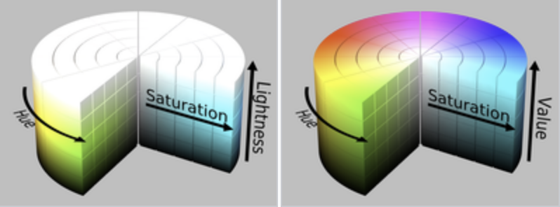

```{r,echo=FALSE,results="hide"}
## Set default options for the knitr RMD processing
knitr::opts_chunk$set(echo=TRUE,warning=FALSE,message=FALSE,fig.width=5,fig.height=5,cache=FALSE,autodep=TRUE, results="hide")
```

```{r, echo=FALSE}
library(tidyverse)
library(ggthemes)
#library(cowplot)
#theme_set(theme_grey())
```


# Principles of data presentation

## Minard

{width=1000}

## Edward Tufte

------------------------------------- ----------------------------------------------
*“Graphical excellence is that which  {width=200px}
gives to the viewer the greatest
number of ideas in the shortest time 
with the least ink in the smallest
space.”*

------------------------------------- ----------------------------------------------

## Edwart Tufte – Books

{width=700px}

## Less is more

Data visualization is all about communication.

Just like in graphics design, less is more. To get a good graphics remove
all excess ink.

## Checklist for making graphs

 * What do I want to say?
 * What do I *need* to say? 
 * What part of my information is redundant?
 * What is the standard way of displaying the information in my field?

Resist the temptation of showing every bit of data. If necessary, put it in
the supplementary materials.

## Average MPG depending on number of cylinders

```{r barplot_01,eval=FALSE}
```

## All bells and whistles


```{r barplot_01,fig.width=6,fig.height=5,echo=FALSE}
p <- mtcars %>% group_by(cyl) %>% 
      summarise(mean_mpg=mean(mpg)) %>%
      mutate(cyl=factor(cyl)) %>% 
      ggplot(aes(x=cyl, y=mean_mpg, fill=cyl))
p + geom_bar(stat="identity", mapping=aes(fill=cyl)) + 
  theme(axis.line=element_line(size=1, arrow=arrow(length=unit(0.1, "inches"))))

```

##

*“Clutter and confusion are failures of design, not attributes of
information.”* (Tufte)

## Remove legend


```{r barplot_02,fig.width=6,fig.height=5,echo=FALSE}
p + geom_bar(stat="identity", mapping=aes(fill=cyl)) + 
  theme(legend.position="none", 
    axis.line=element_line(size=1, arrow=arrow(length=unit(0.1, "inches"))))

```


## Remove axes

```{r barplot_03,fig.width=6,fig.height=5,echo=FALSE}
p + geom_bar(stat="identity", mapping=aes(fill=cyl)) + 
  theme(legend.position="none")
```


## Remove color

```{r barplot_04,fig.width=6,fig.height=5,echo=FALSE}
p + geom_bar(stat="identity", fill="#666666") + 
  theme(legend.position="none")
```


## Narrow bars

```{r barplot_05,fig.width=6,fig.height=5,echo=FALSE}
p + geom_bar(stat="identity", fill="#666666", width=0.5) + 
  theme(legend.position="none")
```


## Remove vertical grid

```{r barplot_06,fig.width=6,fig.height=5,echo=FALSE}
p + geom_bar(stat="identity", fill="#666666", width=0.5) + 
  theme(legend.position="none", panel.grid.major.x=element_blank())
```


## Remove grey background

```{r barplot_07,fig.width=6,fig.height=5,echo=FALSE}
p + geom_bar(stat="identity", fill="#666666", width=0.5) + 
  theme(legend.position="none", panel.grid.major.x=element_blank(), 
    panel.ontop=T, panel.background=element_rect(fill="#FFFFFF00"), 
    panel.grid.major.y=element_line(size=1, color="white"), 
    panel.grid.minor.y=element_line(size=1, color="white"))
```

## Add meaningful labels

```{r barplot_08,fig.width=6,fig.height=5,echo=FALSE}
p + geom_bar(stat="identity", fill="#666666", width=0.5) + 
  theme(legend.position="none", panel.grid.major.x=element_blank(), 
    panel.ontop=T, panel.background=element_rect(fill="#FFFFFF00"), 
    panel.grid.major.y=element_line(size=1, color="white"), 
    panel.grid.minor.y=element_line(size=1, color="white")) + 
    ylab("Mean MPG") + xlab("Number of cylinders")
```

```{r echo=FALSE}
library(cowplot)
theme_set(theme_grey())
```


## Box plots: default R

```{r boxplot_01,fig.width=8,fig.height=5}
boxplot(hwy ~ class, data=mpg)
```

## Box plots: Tufte

```{r boxplot_02,fig.width=8,fig.height=5,eval=FALSE}
```

## Box plots: Tufte

```{r boxplot_02,fig.width=8,fig.height=5,echo=FALSE}
toupper1st <- function(x) 
  paste0(toupper(substring(x, 1, 1)), substring(x, 2))
mpg %>% mutate(class=toupper1st(class)) %>% 
  ggplot(aes(class, hwy)) + geom_tufteboxplot() + theme_tufte() + xlab("") + 
  theme(axis.text=element_text(size=14), axis.title.y=element_text(size=18, margin=margin(0,20,0,0))) +
  theme(axis.ticks.x=element_blank()) +
  theme(axis.text.x=element_text(margin=margin(30,0,0,0)))
```

## Scatter plot variants

```{r scatter_themes,fig.width=8,fig.height=5,echo=FALSE}
p <- list()
p$p1 <- ggplot(mtcars, aes(x=disp, y=hp, color=factor(cyl))) + geom_point() 
p$p2 <- ggplot(mtcars, aes(x=disp, y=hp, color=factor(cyl))) + geom_point() + 
  theme_par()
p$p3 <- ggplot(mtcars, aes(x=disp, y=hp, color=factor(cyl))) + geom_point() + 
  theme_cowplot()
p$p4 <- ggplot(mtcars, aes(x=disp, y=hp, color=factor(cyl))) + geom_point() + 
  theme_tufte()

p <- map(p, ~ . + theme(plot.margin=margin(20, 0, 0, 0)))
plot_grid(plotlist=p, labels=c("Default", "Par", "Cowplot", "Tufte"))
```

## Scatter plot variants

```{r scatter_themes,fig.width=8,fig.height=5,eval=FALSE}
```

##

    
<div class="blank"></div> 
<div class="blank"></div> 
<div class="blank"></div>     
    

*“Above all else show the data.”* (Tufte)


# Common problems and solutions

## Avoid bar charts

 * Bar charts have their purpose: showing proportions or absolute
   quantities (1 value per bar)
 * Y axis must always start at 0, because bar charts communicate with the
   bar surface area
 * Bar charts are often misused to show sample means and sample spread;
   they should be replaced by box plots, violin plots or dot plots.
   
(demo)

*Editorial. "Kick the bar chart habit." Nature Methods 11 (2014): 113.*


## Avoid pie charts

 * Pie charts are bad at communicating information, just don't use them
 * Don't even mention 3D pie charts
 * There are tons of alternatives to pie charts

## Avoid pie charts

```{r,echo=FALSE}
wigplot <- function(i) {
  require(plotwidgets)
  par(mar=rep(0, 4))
  par(mfrow=c(2, 4))
  par(usr=c(0,1,0,1))

  v <- c(.3, .8, .7, .4, .5)
  col <- plotPals("zeileis")

  plot.new()
  wgPie(.5, .5, .8, .8, v, col=col)

  if(i > 0) {
    plot.new()
    wgRing(.5, .5, .8, .8, v, col=col)
  }
  if(i > 1) {
    plot.new()
    wgBurst(.5, .5, .8, .8, v, col=col)
  }
  if(i > 2) {
    plot.new()
    wgBoxpie(.5, .5, .8, .8, v, col=col)
  }
  if(i > 3) {
    plot.new()
    wgPlanets(.5, .5, .8, .8, v, col=col)
  }
  if(i > 4) {
    plot.new()
    wgRug(.5, .5, .8, .8, v, col=col)
  }
  if(i > 5) {
    plot.new()
    wgBarplot(.5, .5, .8, .8, v, col=col)
  }
}
```

```{r echo=FALSE,fig.width=7,fig.height=4}
wigplot(0)
```

## Avoid pie charts

```{r echo=FALSE,fig.width=7,fig.height=4}
wigplot(1)
```

## Avoid pie charts

```{r echo=FALSE,fig.width=7,fig.height=4}
wigplot(2)
```


## Avoid pie charts

```{r echo=FALSE,fig.width=7,fig.height=4}
wigplot(3)
```

## Avoid pie charts

```{r echo=FALSE,fig.width=7,fig.height=4}
wigplot(4)
```

## Avoid pie charts

```{r echo=FALSE,fig.width=7,fig.height=4}
wigplot(5)
```

## Avoid pie charts

```{r echo=FALSE,fig.width=7,fig.height=4}
wigplot(6)
```


# Eine kleine Farbenlehre


## Farbenlehre (Color theory)

 * What is the function of color on the plot?
 * Does the color help or distract?


## Representing colors

There are many ways to represent colors. In R, we most frequently use the
RGB scheme in which each color is composed of three values for each of the
three colors: red, green and blue.

One way is to choose values between 0 and 1; another, between 0 and 255.
The latter can be represented using hexadecimal notation, in which the
value goes from 0 to FF (`15 * 16 + 15 = 255`). This is a very common
notation, used also in HTML:

  * `"#FF0000"` or `c(255, 0, 0)`: red channel to the max, blue and green
    to the minimum. The result is color red.
  * `"#00FF00"`: bright green
  * `"#000000"`: black
  * `"#FFFFFF"`: white

## Getting the colors

   * To get the color from numbers in 0…1 range:

        rgb(0.5, 0.7, 0) # returns "#80B300"

   * To get the color from numbers in 0…255 range:
       
        rgb(255, 128, 0, maxColorValue=255)

## Alpha channel: transparency

Useful way to handle large numbers of data points. `#FF000000`: fully
transparent; `#FF0000FF`: fully opaque.

```{r scatter,fig.width=8,fig.height=4,eval=FALSE}
x <- rnorm(10000)
y <- x + rnorm(10000)
p1 <- ggplot(NULL, aes(x=x, y=y)) + geom_point() + 
  theme_tufte() + theme(plot.margin=unit(c(2,1,1,1), "cm"))
p2 <- ggplot(NULL, aes(x=x, y=y)) + geom_point(color="#6666661F") + 
  theme_tufte() + theme(plot.margin=unit(c(2,1,1,1),"cm"))
plot_grid(p1, p2, labels=c("Black", "#6666661F"))
```

## Alpha channel: transparency

Useful way to handle large numbers of data points. `#FF000000`: fully
transparent; `#FF0000FF`: fully opaque.

```{r scatter,fig.width=8,fig.height=4,echo=FALSE}
```

## Other color systems

There are several other representations of color space, and they do not give
exactly the same results. Two common representations are HSV and HSL: Hue,
Saturation and Value, and Hue, Saturation and Luminosity. 

{width=800}

## Manipulating colors

There are many packages to help you manipulate the colors using hsl and hsv.
For example, my package `plotwidgets` allows you to change it using the HSL model.

```{r plotwidgets,fig.width=5,fig.height=5,eval=FALSE}
library(plotwidgets)
## Now loop over hues
pal <- plotPals("zeileis")
v <- c(10, 9, 19, 9, 15, 5)

a2xy <- function(a, r=1, full=FALSE) {
  t <- pi/2 - 2 * pi * a / 360
  list( x=r * cos(t), y=r * sin(t) )
}

plot.new()
par(usr=c(-1,1,-1,1))
hues <- seq(0, 360, by=30)
pos <- a2xy(hues, r=0.75)
for(i in 1:length(hues)) {
  cols <- modhueCol(pal, by=hues[i])
  wgPlanets(x=pos$x[i], y=pos$y[i], w=0.5, h=0.5, v=v, col=cols)
}

pos <- a2xy(hues[-1], r=0.4)
text(pos$x, pos$y, hues[-1])
```

## Manipulating colors

There are many packages to help you manipulate the colors using hsl and hsv.
For example, my package `plotwidgets` allows you to change it using the HSL model.

```{r plotwidgets,fig.width=5,fig.height=5,echo=FALSE}
```

## Palettes

It is not easy to get a nice combination of colors (see default plot in ggplot2
to see how *not* to do it).

There are numerous palettes in numerous packages.  One of the most popular is
`RColorBrewer`. You can use it with both base R and `ggplot2`.

## RColorBrewer palettes

```{r rcolorbrewer,fig.width=8,fig.height=5,eval=FALSE}
library(RColorBrewer)
par(mar=c(0,4,0,0))
display.brewer.all()
```

## RColorBrewer palettes

```{r rcolorbrewer,fig.width=8,fig.height=5,echo=FALSE}
```

## RColorBrewer palettes: color blind

```{r rcolorbrewer2,fig.width=8,fig.height=5}
par(mar=c(0,4,0,0))
display.brewer.all(colorblindFriendly=T)
```

## Iris data set

    data("iris")

{width=400px}

*The use of multiple measurements in taxonomic problems as an example of linear
discriminant analysis.* Fisher 1936


## Gallery of RColorBrewer palettes

```{r pals01,fig.width=8,fig.height=5}

ggplot(iris, aes(x=Sepal.Length, y=Sepal.Width, color=Species)) + 
  geom_point(size=4) + theme_tufte() + 
  theme(axis.title.y=element_text(margin=margin(0,10,0,0)), 
        axis.title.x=element_text(margin=margin(10, 0, 0, 0)))
```

## Dark2

```{r pals02,fig.width=8,fig.height=5}
ggplot(iris, aes(x=Sepal.Length, y=Sepal.Width, color=Species)) + 
  geom_point(size=4) + scale_color_brewer(palette="Dark2")  + theme_tufte() + 
  theme(axis.title.y=element_text(margin=margin(0,10,0,0)), 
        axis.title.x=element_text(margin=margin(10, 0, 0, 0)))

```


## Paired

```{r pals03,fig.width=8,fig.height=5}
ggplot(iris, aes(x=Sepal.Length, y=Sepal.Width, color=Species)) + 
  geom_point(size=4) + scale_color_brewer(palette="Paired") + theme_tufte() + 
  theme(axis.title.y=element_text(margin=margin(0,10,0,0)), 
        axis.title.x=element_text(margin=margin(10, 0, 0, 0)))

```

## Set2

```{r pals04,fig.width=8,fig.height=5}
ggplot(iris, aes(x=Sepal.Length, y=Sepal.Width, color=Species)) + 
  geom_point(size=4) + scale_color_brewer(palette="Set2") + theme_tufte() + 
  theme(axis.title.y=element_text(margin=margin(0,10,0,0)), 
        axis.title.x=element_text(margin=margin(10, 0, 0, 0)))

```


