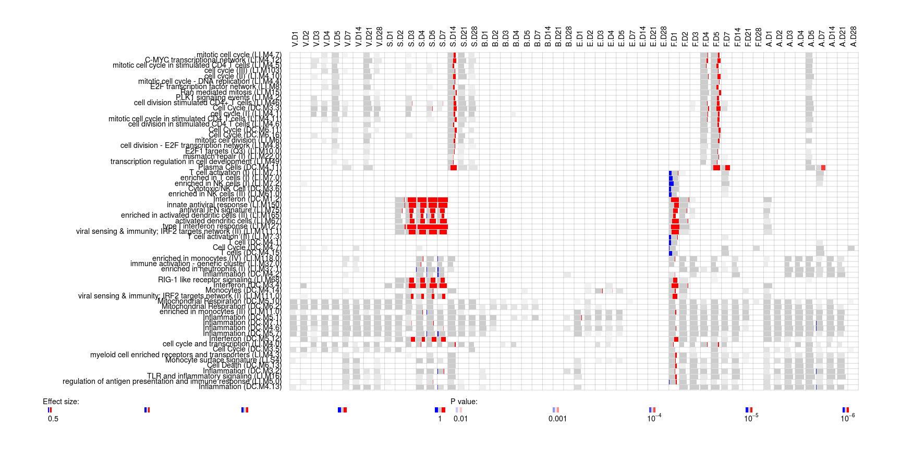
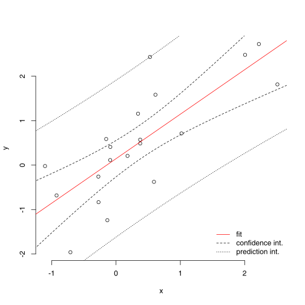
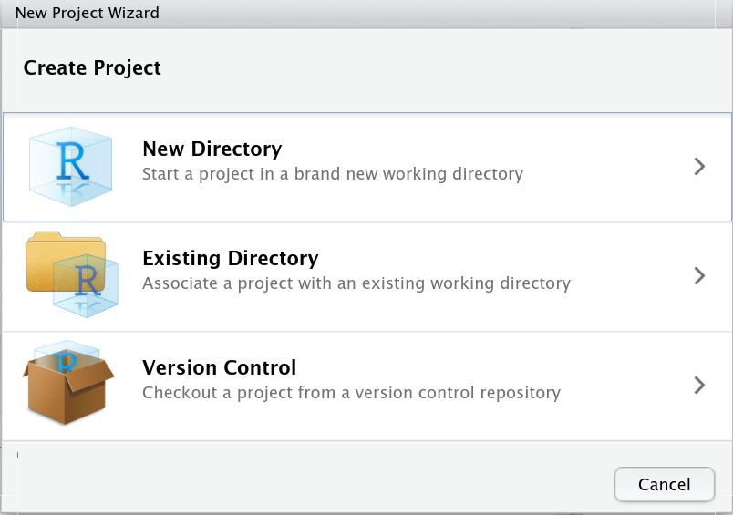

```{r,echo=FALSE}
## Set default options for the knitr RMD processing
knitr::opts_chunk$set(echo=FALSE,warning=FALSE,message=FALSE,fig.width=5,fig.height=5,cache=TRUE,autodep=TRUE, results="hide")
```

```{r}
library(tidyverse)
library(ggthemes)
library(cowplot)
theme_set(theme_grey())
```


# R packaging

## Why would I want to build packages?

> * organize the code
> * reuse your code!
> * freeze a code version
> * make it easy to install on other computers
> * share!

## Why wouldn't I want?

> * takes time => yeah, but saves time in the long run
> * I have to learn it => you will learn it here
> * nobody will want to use it => you will want to use it, and you never really know
> * it's hard => no, it isn't

## The story of `tmod`

{width=1000px}

## R package 

To create an R package, we need to have a directory with a few files and
directories in it. The main directory should have the name of the package
we are building.

Don't worry, all the necessary files and directories will be created when
you create a project in rstudio or run `usethis::create_package`. 

## Example

{width=500}


## R package steps

 * create package (`rstudio`, `usethis`)
 * development cycle:

    * write some code
    * load into session to test (`load_all()`)
    * document (`document()`)
    * check (`check()`)
    * build (`build()`)
    * install (`install()`)

## R package directory structure

      helloworld
            ├── DESCRIPTION*      // main package info
            ├── NAMESPACE*        // what should be visible
            ├── NEWS
            ├── ChangeLog         // what's new?
            ├── man*              // manuals, automatically generated
            │   └── hello.Rd
            ├── R*
            │   └── hello.R       // the actual code 
            ├── data
            │   └── somedata.rda  // data you wish to include
            ├── src               // C code
            ├── inst              // what else to install?
            ├── tests
            │   ├── testthat
            │   └── testthat.R
            └── vignettes         // informal package description
                └── hello.pdf

## DESCRIPTION

    Package: tmod
    Type: Package
    Title: Feature Set Enrichment Analysis for Metabolomics and Transcriptomics
    Version: 0.41
    Date: 2019-05-29
    Author: January Weiner
    Maintainer: January Weiner <january.weiner@gmail.com>
    Description: Methods and feature set definitions for feature or gene set
      enrichment analysis in transcriptional and metabolic profiling data.
      Package includes tests for enrichment based on ranked lists of features,
      functions for visualisation and multivariate functional analysis.
    License: GPL (>=2.0)
    Depends: R (>= 2.10)
    LazyData: false
    VignetteBuilder: knitr
    URL: http://bioinfo.mpiib-berlin.mpg.de/tmod/
    Imports:
        beeswarm,tagcloud,XML,methods,plotwidgets
    Suggests:
        testthat,knitr,rmarkdown,pca3d,limma
    RoxygenNote: 6.1.1
    Encoding: UTF-8


## NAMESPACE

    # Generated by roxygen2: do not edit by hand

    export(hello)

NAMESPACE will be automatically generated for you if you use 
devtools to manage your package. To generate NAMESPACE and documentation,
use the following command:

    devtools::document("mypackage")

## Documentation

		% Generated by roxygen2: do not edit by hand
		% Please edit documentation in R/hello.R
		\name{hello}
		\alias{hello}
		\title{Say hello to my little friend}
		\usage{
		hello()
		}
		\description{
		Say hello to my little friend
		}
		\examples{
		hello()
		}

## Documenting functions

```r
#' Function for adding two numbers
#'
#' This function adds two numbers
#' 
#' @param a first number
#' @param b second number
#' @return sum of the numbers
#' @export
add2nums <- function(a, b) {
  a + b
}
```

## More on that

 * always start with `#' `
 * `@param` – parameter
 * `@return` – return value
 * `@export`– the function should be accessible to users
 * `@seealso` – other related functions
 * `@examples` – section with examples


 

## Setting up new packages

 * with GUI in rstudio
   * some functionality missing
   * mind that rstudio changes *into* the package 
     directory, so keep that in mind when you use `devtools` to build documentation.
 * using the `usethis()` package
   * `create_package("directory")`
   * `proj_activate("directory")`
   * `use_*()` to add elements of the package


## `devtools`

The `devtools` package facilitates and automates managing of the package.

## Vignettes

Vignette is a free-style documentation of a package. You can write it in
rmarkdown. Type

```r
usethis::use_vignette("somename")
```

(typically "somename" is the name of your package)

Later, the users can view it:

```r
vignette("somename")
```

## Importing packages

Whenever you use a function that is not in the R `base` package, you *must*
tell the package to import it. It is easiest way is to either import the
whole package, or import specific functions from a package using roxygen2:

```r
#' @import ggplot2
#' @importFrom stats lm loess
#' @export
myfunc <- function(...) {
  ...
  loess(...)
  ggplot(...) + ...
}
```

# Git

## github.com

`git` is a *distributed version control system* created by Linus Torvalds for the
development of Linux kernel.

[github.com](https://github.com) is a website which provides space for git repositories and an
easy to use interface system. 

* Online book: [Happy git with R](https://happygitwithr.com/)

Alternatives to `github.com`:

 * [gitlab.com](https://gitlab.com) – open source, you can deploy your own server!
 * [bitbucket.org](https://bitbucket.org)

## Reasons to use git & github

 * version control: like "undo" but much better
 * backup of your project
 * distribution system (you can install R packages directly from github)
 * great collaboration tools
 * advanced: development branches, parallel development etc.
 
## `git` basic basics

 * Write some code.
 * Mark the files that you are happy with ("stage")
 * Tell git to save the checkpoint ("commit")
 * From time to time, propagate to the github repository ("push")

## `git` basic basics

Following things are possible with git:

 * View each checkpoint ("commit") 
 * Revert to any commit
 * Compare two commits
 * Branch (e.g. development branch, production branch)
 * Collaborate

Git is 100% open source, does not depend on network (no central repository,
each local copy is a full repository of the given project or its selected
branches).

## `git` lingo

  * `staged`: changes prepared to be committed
  * `commit`: update the local repository information with the changes
  * `push` – put the committed updates on the remote repository
  * `pull` – get updates from the remote repository
  * you can easily set up "credentials" (SSH key) on your local machine
    such that you don't need to log in each time you do something with git
  * 'SHA': you will find that often in articles about git. This 
    refers to the fact that commits are identified by a "hash" (hence
    'sha') and so often it simply means "commit"

## github and rstudio: the basics

In the following, we assume that we have already a project (call it
"myfuncs") with the necessary files and that we want to connect it to a
github repository. 

There are a number of options, but in any case, log in to github and
create a new project (let us call it "myfuncs").

Also, you need to have git installed:

 * Windows: http://msysgit.github.io
 * MacOS: http://sourceforge.net/projects/git-osx-installer/
 * Linux: use one of the packages from your distro

## github and rstudio

Rstudio serves as a UI for git and gihub, so you basically don't have to
worry about all the command line git options. However, you need to set it
up. This is going to get a bit technical, but no worries: you only need to
do it once.


Basically, there are two options.

 * Create a project on github, and *then* create a new project telling
   rstudio that it is to be a git project
   connected to github.  Downside: you need to manually add the necessary
   files (e.g. copy them from the existing project). Easy, and copying
   files is not a big deal.

 * Directly an existing project. Downside:
    * you need to tell rstudio to use git.
    * you need to tell git to use github.


## github and rstudio: option 1 (easy!)

 1. Create a new project on github.com (gitlab also works!)
 2. Copy the URL (big green button, "Code").
 3. Create a new project in Rstudio. **Beware!** select the "Version
    control". 

    {width=300}
 4. Enter the URL. Use a new folder and a new session.
 5. Copy whatever files you have already made for this project.
 6. Commit & Push in the "git" tab in the right upper corner.

## github and rstudio: option 2

What to do if you want to link an existing project to a github repo.

 1. tell rstudio to use git (Tools -> Version Control -> Project Setup)
 2. open shell (git tab -> More -> Shell) and enter the following commands
    to tell git that you are using github (replace "january3" by your user
    name and "myfuncs" by your project name):

        git remote add origin https://github.com/january3/myfuncs.git
        git pull origin master
        git push -u origin master

 2. Note: the address above is a https connection. This has drawbacks:
  * if you use the `https://...` URL, you will need to enter your password
    each time.
  * if you use `ssh`, you need to install and configure SSH and SSH keys,
    but the authentication process will be easier. 
 3. restart rstudio


## github and rstudio: taking care of stray files

There are files in your package that you might want to keep, but which
should not be handled by git. For example, the `.Rproj` files or the
`.Rhistory` file.

Add them to the file `.gitignore`. This files then will not be pushed to
your github repository, but they will also not be cleaned by git.

## github and rstudio: undoing changes (GUI)

 * Before you have commited and staged the changes, when you open the
   "commit" dialog
   (commit button on the git tab), you can click on "discard all" or
   "discard chunk" buttons. *This will reverse the changes you made to
   files!*
 
 * If the changes are staged, but not *committed*, click on the "Unstage"
   button.

## github and rstudio: undoing changes

How to undo the changes? The best way is to use git commands for that. To
do this, click on the wheel icon on the git tab and select "shell". Then
  type:

 * To see what is currently going on, do `git status`

 * if you have made changes, and you want to revert them, but you have not
   *staged* or *commited* any of them, type
         
         git clean -di
         git checkout -- .
  
   Warning: files which are not tracked by git will be deleted! (with the
   -i option, git will ask you before deleting)

 * if the changes are staged, you can unstage *all* of them as follows:  

         git reset HEAD -- .

   The changes are still there, but they are neither staged nor committed.

## undoing committed changes

If the changes are committed (but not pushed to github), use one of the following commands:

         git reset --soft HEAD~1
         git reset --hard HEAD~1

The first one undoes the committment and results in changes still being
there, however now they are only staged and you can unstage them.

The latter one undoes all changes, full stop.
   
Did you notice the `1` in `HEAD~1`? If you replace it by 2, 3, etc. you can
travel back in history and remove 1, 2, 3 etc. committments. 

## Changes committed and pushed

If you have pushed the committed changes to github, it is better to use
`revert` than `reset`. For this, you need the SHA (the identifier of the
commit) that you want to revert.

Go to the git history window (click on the clock icon), and take a look at
the strange code called "SHA". You can copy it from the lower part of the
window. It looks something like this: fc637fb0.

Now do the following:

    git revert fc637fb0

This will introduce a new commit which will reverse the commit with the ID
fc637fb0. In many cases it is possible to revert a commit from further back
in history.


## undoing committed changes on master

When you have used `git reset` to undo the changes locally, you will have
issues pushing them to the github repository: your commit will be rejected.
In such a case instead of clicking on the green arrow in rstudio, open the
shell and run the following command:

     git push --force
